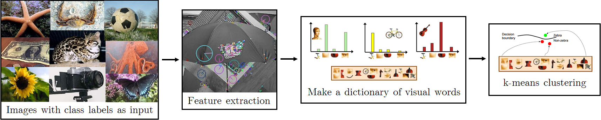
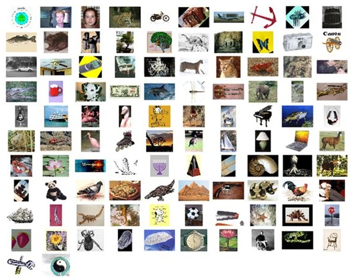

<h1>Bag of Visual Words OpenCV </h1>

An example of a typical bag of words classification pipeline refer to content based image classifier using the <a href="https://en.wikipedia.org/wiki/Bag-of-words_model_in_computer_vision">bag of visual words model</a> in C++ with OpenCV.

 

<h2>Overview</h2> 
The goal of this project is to introduce you to image recognition. Specifically, we will examine the task of scene recognition starting with very simple methods - tiny images and nearest neighbor classification - and then move on to techniques that resemble the bags of quantized local features and linear classifiers learned by support vector machines (SVM).

Bag of words models are a popular technique for image classification inspired by models used in natural language processing (NLP). The model ignores or downplays word arrangement (spatial information in the image) and classifies based on a histogram of the frequency of visual words. The visual word "vocabulary" is established by clustering a large corpus of local features. See Szeliski chapter 14.4.1 for more details on category recognition with quantized features. In addition, 14.3.2 discusses vocabulary creation and 14.1 covers classification techniques.

The program will generate a visual vocabulary and train a classifier using a user provided set of already classified images. After the learning phase, we will use the generated vocabulary and the trained classifier to predict the class for any image given to the script by the user.

The learning consists of:

1.
    Extracting local features of all the dataset image with SIFT feature extractor
2.
    Generating a codebook of visual words with clustering of the features
3.
    Aggregating the histograms of the visual words for each of the traning images
4.
    Feeding the histograms to the SVM classifier to train a model

This code relies on:

1.
    SIFT features for local features
2.
    k-means for generation of the words via clustering
3.
    SVM as classifier using the OpenCV library

The example dataset used in this project is [Caltech 101 dataset][1].

Example images from of each category of Caltech 101.

## Author

[Hadi Abdi Khojasteh](http://hadiabdikhojasteh.ir)

## Copyright
Copyright (c) 2018 Hadi Abdi Khojasteh

## License
GNU General Public License v3.0

[1]: http://www.vision.caltech.edu/Image_Datasets/Caltech101/
